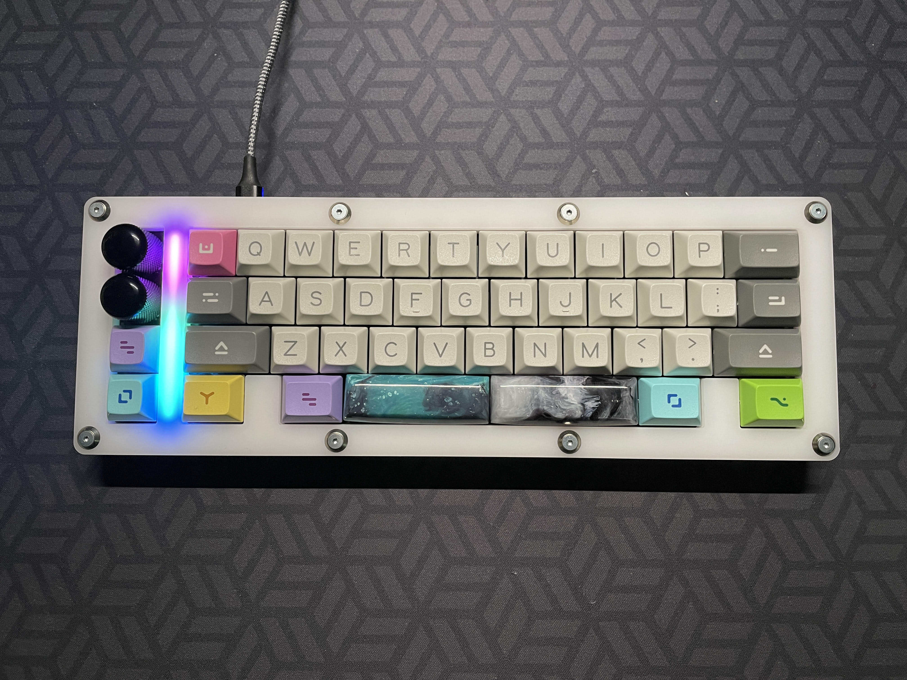
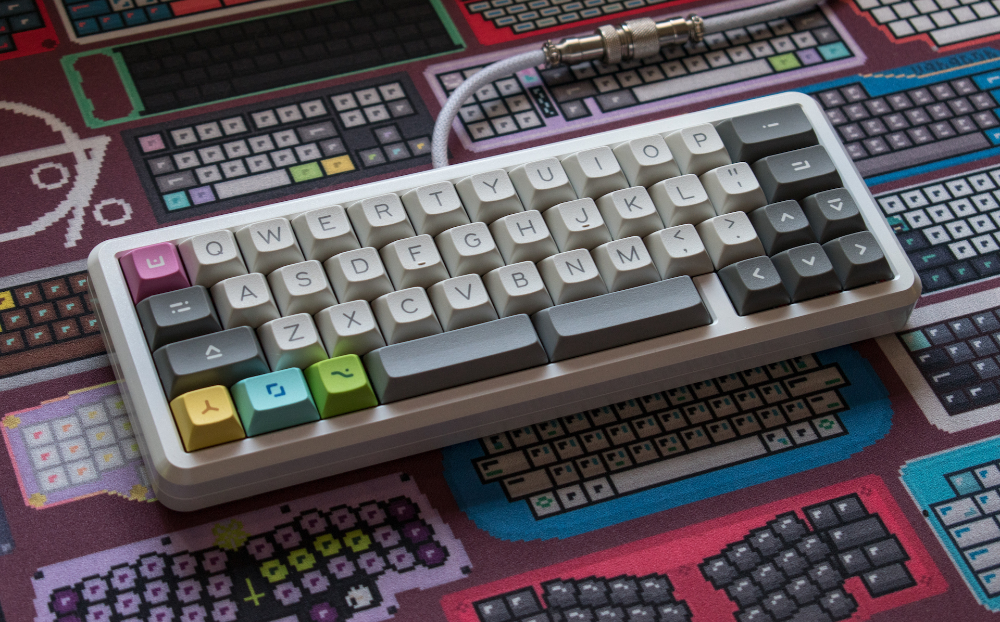

# open-source-projects

**Repository for projects by MelonBred**

This is a repository for all open-sourced or available files for my projects. PCBs will typically have their own repository linked in the table below. Everything else will probably be found here in this repository but still linked in the tables below.

---

## Keyboards

| _Project_                                                                                | _Description_                                                                                 | _Available Files_           | Image                                                                   |
| ---------------------------------------------------------------------------------------- | --------------------------------------------------------------------------------------------- | --------------------------- | ----------------------------------------------------------------------- |
| [MBLB](https://github.com/melonbred/open-source-projects/tree/main/keyboards/mblb)       | 12.5u main cluster + macro column 40% keyboard, rotary encoder support, STM32 microprocessor. | KiCAD, Gerbers, .dxf, .step |   |
| [MB-44](https://github.com/melonbred/open-source-projects/tree/main/keyboards/mb44)      | The MB-44 is a 12.75u layout with a fun 65%-esque blocker separating the arrow cluster.       | KiCAD, Gerbers, .dxf, .step |     |
| [Pegasus](https://github.com/melonbred/open-source-projects/tree/main/keyboards/pegasus) | 12.75u 40% keyboard with 0.75u "WKL" blockers                                                 | KiCAD, Gerbers, .step, .fbx |  |

## PCBs

| _Project_                                                         | _Description_                                                                                                                              | _Available Files_     | Image                                                                                                        |
| ----------------------------------------------------------------- | ------------------------------------------------------------------------------------------------------------------------------------------ | --------------------- | ------------------------------------------------------------------------------------------------------------ |
| [Program Yoink!](https://github.com/melonbred/program-yoink)      | 12u main cluster with exploded arrows and macro columm                                                                                     | KiCAD, Gerbers        |    |
| [SPM1800](https://github.com/melonbred/SPM1800)                   | Southpaw compact mini 1800                                                                                                                 | KiCAD, Gerbers        |     |
| [kb-daughterboard](https://github.com/melonbred/kb-daughterboard) | USB-C daughterboard with ESD, overcurrent and overvoltage protection. 2 versions available - USB-C receptacle flush with PCB and protruded | KiCAD, Gerbers, .step |  |

## Miscellaneous

| _Project_                                                                                                  | _Description_                                       | _Available Files_ | Image                                                                                                                         |
| ---------------------------------------------------------------------------------------------------------- | --------------------------------------------------- | ----------------- | ----------------------------------------------------------------------------------------------------------------------------- |
| [MB-44 Plates](https://github.com/melonbred/open-source-projects/tree/main/miscellaneous/mb44-plate-files) | Plate files for the MB-44 keyboard                  | .dxf              |
| [Encoder Knob](https://github.com/melonbred/open-source-projects/tree/main/miscellaneous/encoder-knobs)    | Generic knob that fits EC11 encoders. 3d printable. | .step, .stl       |  |
